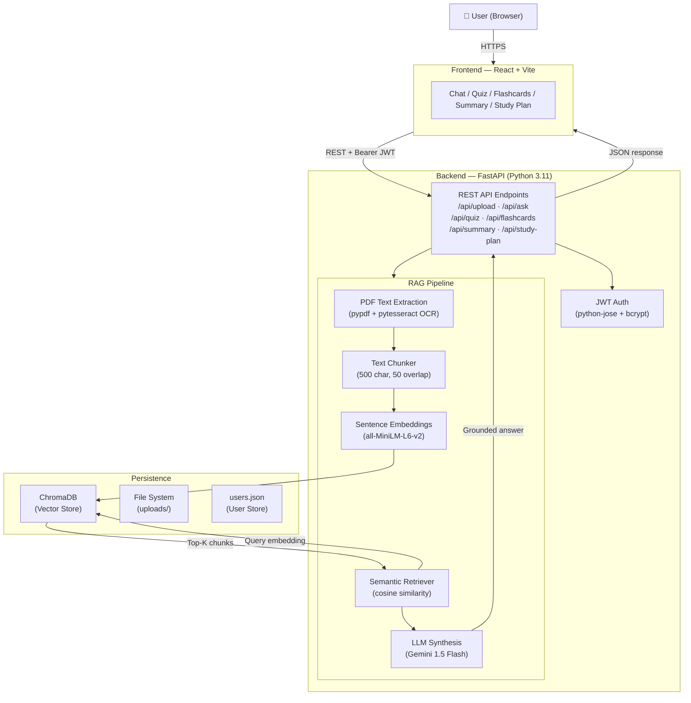

<div align="center">

# 🎓 AI Learning Assistant

**A production-quality RAG-powered study platform built with FastAPI, React, and ChromaDB.**

Upload any PDF → Ask questions → Get AI-synthesized answers with source citations.

[](https://huggingface.co/spaces/Shreya15err2/AI-learning-assistant)
[](https://fastapi.tiangolo.com)
[](https://react.dev)
[](https://python.org)
[](https://docker.com)
[](LICENSE)

</div>

---

## 📋 Table of Contents

- [Problem Statement](#-problem-statement)
- [Features](#-features)
- [Architecture](#-architecture)
- [Tech Stack](#-tech-stack)
- [Project Structure](#-project-structure)
- [Quick Start — Local](#-quick-start--local-development)
- [Docker](#-docker)
- [Environment Variables](#-environment-variables)
- [API Documentation](#-api-documentation)
- [RAG Pipeline](#-rag-pipeline)
- [Security](#-security)
- [Roadmap](#-roadmap)
- [Contributing](#-contributing)
- [License](#-license)

---

## 🎯 Problem Statement

Students studying from PDFs spend hours manually:
- Searching for relevant passages to answer a question
- Creating flashcards and quiz questions by hand
- Writing summaries of dense academic content
- Building study schedules without knowing how much material there is

**AI Learning Assistant** automates all of this. Upload a PDF and the app extracts, indexes, and makes your content instantly queryable — with AI-synthesized answers grounded in your own material.

---

## ✨ Features

| Feature | Description |
|---------|-------------|
| 📂 **PDF Upload** | Upload any PDF — text extracted via `pypdf` with OCR fallback (pytesseract) for scanned documents |
| 💬 **AI Chat (RAG)** | Ask natural-language questions — Gemini 1.5 Flash synthesizes answers from retrieved passages with citations |
| 🃏 **Flashcards** | Auto-generate flip cards from key definitions and concepts |
| 📝 **Quiz Generator** | Fill-in-the-blank MCQs generated directly from document content |
| 📄 **Smart Summary** | TF-weighted extractive summarization — not just text truncation |
| 📅 **Study Planner** | Input your exam date and get a day-by-day schedule |
| 🔐 **Authentication** | JWT + bcrypt-hashed credentials |
| ⚡ **Sub-second Retrieval** | ChromaDB cosine similarity search returns results in <200ms |
| 🐳 **Docker Ready** | Multi-stage Dockerfile — frontend and backend in a single container |

---

## 🏗 Architecture



---

## 🛠 Tech Stack

| Layer | Technology | Purpose |
|-------|-----------|---------|
| **Frontend** | React 18 + Vite | SPA with fast HMR in dev |
| **Backend** | FastAPI + Uvicorn | Async REST API |
| **Vector DB** | ChromaDB | Local persistent vector store |
| **Embeddings** | `all-MiniLM-L6-v2` (sentence-transformers) | 384-dim dense embeddings |
| **LLM** | Google Gemini 1.5 Flash | RAG answer synthesis |
| **PDF Parsing** | `pypdf` + `pytesseract` | Text extraction + OCR fallback |
| **Auth** | `python-jose` (JWT) + `bcrypt` | Token-based authentication |
| **Deployment** | Docker + HuggingFace Spaces | Single-container production deployment |
| **CI/CD** | GitHub Actions | Lint + build on every PR |

---

## 📁 Project Structure

```
AI-Learning-Assistant/
├── backend/
│   ├── api/                  # FastAPI route handlers
│   │   ├── ask.py            # ★ RAG + Gemini chat endpoint
│   │   ├── upload.py         # PDF upload with validation
│   │   ├── quiz.py           # MCQ quiz generation
│   │   ├── flashcards.py     # Flashcard generation
│   │   ├── summary.py        # TF-weighted extractive summary
│   │   ├── studyplan.py      # Study schedule generator
│   │   ├── documents.py      # List / delete documents
│   │   └── auth.py           # Register / login / me
│   ├── database/
│   │   └── chroma.py         # ChromaDB client + CRUD
│   ├── models/
│   │   └── schemas.py        # Pydantic request/response models
│   ├── rag/
│   │   └── retriever.py      # Semantic search + context builder
│   ├── services/
│   │   ├── embedding_service.py  # SentenceTransformer wrapper
│   │   └── ocr_service.py        # pypdf + pytesseract extraction
│   ├── utils/
│   │   ├── config.py         # All env-var configuration
│   │   ├── auth_utils.py     # JWT + bcrypt helpers
│   │   └── text_processing.py# Chunking, cleaning, dedup
│   ├── main.py               # FastAPI app + lifespan + CORS
│   ├── requirements.txt
│   └── .env.example
├── frontend/
│   ├── src/
│   │   ├── pages/            # ChatPage, QuizPage, FlashcardsPage, etc.
│   │   ├── components/       # Sidebar, UploadBanner, Flashcard
│   │   ├── utils/
│   │   │   ├── api.js        # Typed API client
│   │   │   └── auth.js       # Token helpers
│   │   └── styles/
│   │       └── global.css    # Design system (CSS variables + all styles)
│   ├── index.html
│   ├── vite.config.js
│   ├── package.json
│   └── .env.example
├── .github/
│   ├── workflows/
│   │   ├── ci.yml            # Lint + build CI
│   │   └── keep-alive.yml    # HuggingFace Space keep-alive
│   ├── ISSUE_TEMPLATE/
│   └── PULL_REQUEST_TEMPLATE.md
├── Dockerfile                # Multi-stage build
├── .gitignore
├── LICENSE
├── CONTRIBUTING.md
├── SECURITY.md
├── CHANGELOG.md
└── CODE_OF_CONDUCT.md
```

---

## 🚀 Quick Start — Local Development

### Prerequisites

- Python 3.11+
- Node.js 20+
- (Optional) Tesseract OCR — only for scanned PDFs
- (Optional) Poppler — only for scanned PDFs on Windows

### 1. Clone

```bash
git clone https://github.com/Shreya15err2/AI-Learning-Assistant.git
cd AI-Learning-Assistant
```

### 2. Backend

```bash
cd backend

# Create and activate virtual environment
python -m venv venv
source venv/bin/activate       # macOS/Linux
# venv\Scripts\activate        # Windows

# Install dependencies
pip install -r requirements.txt

# Configure environment
cp .env.example .env
# Edit .env — add your GEMINI_API_KEY and JWT_SECRET

# Start backend (port 8001)
uvicorn main:app --host 127.0.0.1 --port 8001 --reload
```

📖 API docs available at: **http://127.0.0.1:8001/docs**

### 3. Frontend

In a second terminal:

```bash
cd frontend
npm install
npm run dev
```

Open **http://localhost:5173** in your browser.

> **Note:** The Vite dev server proxies `/api` requests to `http://localhost:8001` automatically.

---

## 🐳 Docker

Build and run the complete application (frontend + backend) in a single container:

```bash
# Build
docker build -t ai-learning-assistant .

# Run (with your API key)
docker run -p 7860:7860 \
  -e GEMINI_API_KEY=your_key_here \
  -e JWT_SECRET=your_strong_secret \
  ai-learning-assistant
```

Open **http://localhost:7860**

---

## 🔑 Environment Variables

All configuration is environment-driven. See [`backend/.env.example`](backend/.env.example) for the full reference.

| Variable | Required | Default | Description |
|----------|----------|---------|-------------|
| `GEMINI_API_KEY` | ⚠️ Recommended | `""` | Google Gemini API key. Without it, the app falls back to direct text retrieval. Get a free key at [makersuite.google.com](https://makersuite.google.com/app/apikey) |
| `JWT_SECRET` | ✅ Yes (prod) | Dev fallback | Secret key for JWT signing. Generate: `python -c "import secrets; print(secrets.token_hex(32))"` |
| `MAX_UPLOAD_MB` | No | `25` | Maximum PDF upload size in MB |
| `ALLOWED_ORIGINS` | No | `localhost:5173,localhost:3000` | Comma-separated CORS allowed origins |
| `TOP_K_RESULTS` | No | `5` | Number of chunks retrieved per query |
| `EMBEDDING_MODEL` | No | `all-MiniLM-L6-v2` | HuggingFace sentence-transformers model |

---

## 📡 API Documentation

**Base URL:** `http://127.0.0.1:8001/api`  
**Interactive Docs:** [/docs](http://127.0.0.1:8001/docs) (Swagger UI) · [/redoc](http://127.0.0.1:8001/redoc)

| Method | Endpoint | Auth | Description |
|--------|----------|------|-------------|
| `POST` | `/auth/register` | — | Create a new account |
| `POST` | `/auth/login` | — | Login and receive JWT |
| `GET`  | `/auth/me` | ✅ | Get current user info |
| `POST` | `/upload` | — | Upload a PDF (multipart/form-data) |
| `GET`  | `/documents` | — | List all indexed documents |
| `DELETE` | `/documents/{id}` | — | Delete a document and its vectors |
| `POST` | `/ask` | — | Ask a question (RAG) |
| `POST` | `/flashcards` | — | Generate flashcards |
| `POST` | `/generate-quiz` | — | Generate MCQ quiz |
| `POST` | `/summary` | — | Summarize document |
| `POST` | `/study-plan` | — | Create study schedule |
| `GET`  | `/health` | — | Health check |

---

## 🔍 RAG Pipeline

```
User Question
      │
      ▼
[Embed query]  ←  sentence-transformers (all-MiniLM-L6-v2)
      │
      ▼
[ChromaDB cosine search]  →  top-K most similar chunks
      │
      ▼
[Build context]  →  chunks with [Source: filename, Page N] citations
      │
      ▼
[Gemini 1.5 Flash]  →  grounded, coherent answer
      │
  (fallback if no API key)
      │
      ▼
[Direct retrieval]  →  return raw chunks with citations
```

**Chunking strategy:**
- Sentence-aware splitting at `.!?` boundaries
- Chunk size: 500 characters (configurable)
- Overlap: 50 characters for context continuity
- Deduplication: MD5 hash per chunk before storage
- Minimum chunk length: 100 characters (merge short chunks)

**Hallucination prevention:**
- System prompt explicitly instructs the LLM to answer only from context
- Grounded prompt includes `[Source: filename, Page N]` markers
- Fallback to direct retrieval when LLM is unavailable

---

## 🔒 Security

- **Passwords:** bcrypt with work factor 12
- **JWT:** HS256 with configurable secret; 7-day token expiry
- **File uploads:** Extension + MIME validation, 25 MB size limit, filename sanitization (path traversal prevention)
- **CORS:** Explicit allowed origins (no wildcard with credentials)
- **Secrets:** JWT and API keys via environment variables only — never in code

See [SECURITY.md](SECURITY.md) for vulnerability reporting.

---

## 🗺 Roadmap

- [ ] **Streaming responses** — stream Gemini output token-by-token to the UI
- [ ] **Multi-document RAG** — cross-document retrieval with source attribution
- [ ] **PostgreSQL** — replace flat-file user store with proper database
- [ ] **Conversation memory** — multi-turn context window for follow-up questions
- [ ] **Export** — download flashcards as Anki decks, quizzes as PDF
- [ ] **Document chunking UI** — show how the PDF was chunked for debugging
- [ ] **Rate limiting** — per-user request throttling
- [ ] **Re-ranking** — cross-encoder re-ranking of retrieved chunks for higher precision

---

## 🤝 Contributing

Contributions are welcome! Please read [CONTRIBUTING.md](CONTRIBUTING.md) before opening a PR.

1. Fork the repo
2. Create a feature branch: `git checkout -b feature/my-feature`
3. Make changes and test them
4. Open a PR against `main`

---

## 📄 License

MIT © [Shreya Shukla](https://github.com/Shreya15err2)

See [LICENSE](LICENSE) for full text.
